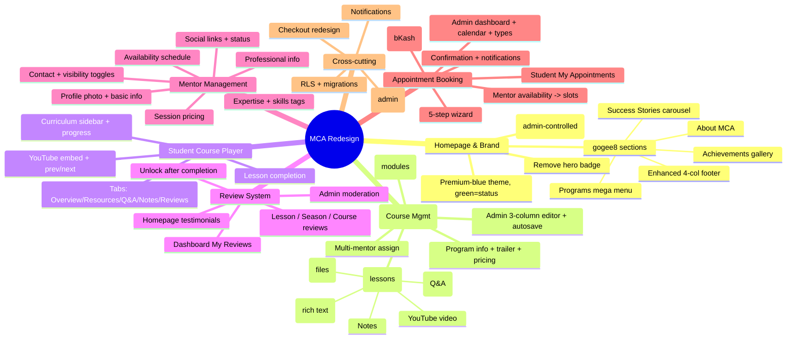

# MCA Full Redesign — Master Plan & Session Handoff

> **READ ME FIRST (Claude).** This is the single source of truth for the "fully
> redesign the website" effort. When a new session starts, read this file top to
> bottom and you will know: what MCA is, what already exists in the codebase, what
> we are converting it into, the design rules, and the exact chunked roadmap.
> The user will typically say: *"Read MCA_REDESIGN_MASTERPLAN.md and start Chunk N."*
> Then execute that chunk against its Acceptance Criteria, and update the
> **Progress Tracker** (§12) at the end of the session.
>
> Companion docs (all under the repo):
> - `fully redesign the website/convertion of the website MCS.md` — the **primary
>   client spec** this plan must fully satisfy (WhatsApp button, LMS, Mentor mgmt,
>   Appointments).
> - `docs/MCA Homepage Redesign Documentation .md` — homepage + checkout spec.
> - `docs/MCS main idea.md` — brand identity / design language.
> - `docs/PROJECT_CONTEXT.md` + `docs/HANDOVER.md` — what the MVP already shipped.
> - UI reference images live next to this file (see §7).
>
> _Created: 2026-07-22. Keep the Progress Tracker (§12) current — it is how future
> sessions know where we are._

---

## 1. How to use this document

1. **Resuming work:** read §2 (state), §4 (design rules), §12 (progress), then open
   the chunk you were asked to do in §11.
2. **Each chunk is self-contained**: it lists Goal → Source spec → DB migrations →
   Files → Acceptance Criteria → Dependencies. Do the migrations first, then
   server actions/features, then UI, then verify.
3. **Before writing any Next.js code**, obey `AGENTS.md`: *"This is NOT the Next.js
   you know."* Read the relevant guide in `node_modules/next/dist/docs/` first.
   The installed version is **Next.js 16** (App Router, RSC, TS strict).
4. **Respect the gotchas** in §10 — they are real bugs we already paid for.
5. When a chunk is done: run `npm run build`, drive the flow (use the `verify`
   skill / headless CDP pattern), then tick the tracker.

---

## 2. Project snapshot (what exists today)

- **Product:** Meaningful Career Academy (MCA) — a premium, **mentorship-first**
  education platform for Bangladesh. Mentorship is the core; courses, e-books,
  live classes, mock tests, Ask-a-Mentor, blog, community are supporting pillars.
- **Status:** MVP is feature-complete, deployed, live. This redesign is **Phase 2**:
  a premium visual rebrand + four large new modules.
- **Live:** https://mcs-pi.vercel.app · **Repo:** github.com/websitemeaningfullwork/MCS (`main`) · **Host:** Vercel (auto-deploy on push) · **Backend:** Supabase (Postgres + Auth + Storage + RLS, region Singapore).

### Stack (locked)
Next.js **16** (App Router, RSC, TS strict) · Tailwind CSS **v4** (`@theme` in
`src/styles/globals.css`) · shadcn/ui + Radix + lucide-react · react-hook-form + zod ·
Framer Motion (subtle) · Supabase (typed with `<Database>`) · react-markdown + remark-gfm.

### Repo map (the parts you'll touch)
```
src/
  app/
    (marketing)/  about contact programs mentors resources blog community
                  live-classes mock-tests privacy refund terms  (+ [slug]/[id])
    (auth)/       login register forgot-password reset-password
    checkout/     manual bKash checkout  (page.tsx, error.tsx)
    dashboard/    student area — learn/[programSlug], orders, questions,
                  resources, programs, bookmarks, settings
    mentor/       mentor panel — profile, programs, questions
    admin/        admin panel — programs, mentors, resources, blog, live-classes,
                  mock-tests, payments, questions, users, settings
    page.tsx      HOMEPAGE  ·  sitemap.ts · robots.ts · opengraph-image.tsx
  components/     ui/ (shadcn) · marketing/ · dashboard/ · admin/ · mentor/ ·
                  checkout/ · mock-tests/ · shared/ (navbar, footer, logo, toggles)
  features/       auth contact payments profile questions learning mock-tests
                  mentor bookmarks admin/*   (server actions + zod schemas)
  lib/            supabase/{server,browser,admin,public}.ts, admin-guard.ts,
                  mentor-guard.ts, constants.ts, format.ts, slug.ts, i18n.ts
  types/          database.types.ts  (hand-authored, matches gen-types shape)
  proxy.ts        session refresh + route guards (was middleware.ts)
supabase/migrations/  000..008  (SINGLE SOURCE OF TRUTH — apply in order)
```

### What's already built & live (don't rebuild — extend)
Public: Home (hero + 5 feature cards + programs + mentors + Continue Journey + Ask
a Mentor + stats), About, Contact, Programs (list+detail), Mentors (list+detail),
Resources/E-books, Blog, Community, Live Classes, Mock Tests (server-scored).
Auth: email + Google, roles `student|mentor|admin`. Student dashboard, mentor panel,
admin panel (CRUD for all content), manual bKash checkout. SEO/PWA-lite. RLS ON
everywhere. The current homepage **already matches** the premium-blue redesign doc
(hero "Learn Today, Lead Tomorrow", colorful feature cards) — see `src/app/page.tsx`.

---

## 3. The vision — what we are converting MCA into

MCA becomes a **complete premium mentorship + LMS ecosystem**, where an admin can
run the entire platform with **zero code changes**, and students get an Apple/
Stripe/Linear-grade experience. Four new pillars sit on top of the MVP:

1. **A real LMS** — Programs → Seasons → Classes, each class with video, rich
   overview, resources, quiz, notes — all editable from one admin workspace.
2. **A premium student course player** — sidebar curriculum, YouTube embed,
   prev/next, tabs, progress, reviews.
3. **A full mentor administration system** — one page controlling a mentor's
   profile, contacts+visibility, expertise, availability, pricing, socials, status.
4. **An end-to-end appointment booking system** — 5-step wizard, mentor schedules,
   payment, notifications, and a full admin appointment dashboard.

Plus cross-cutting polish: an admin-controlled **floating WhatsApp button**, a
**review system** feeding homepage social proof, and a **gogee8-inspired homepage
& footer** (structure only — MCA's own colors).

### The one-line test
> A visitor lands and feels: *"This is where someone will personally guide me
> toward my career"* — not *"this site wants to sell me a course."*

---

## 4. Design system & non-negotiable rules

**Theme — Premium Blue rebrand (green = status only).**
- Primary palette: **Premium Blue / Sky Blue / Royal Blue**, with **Purple, Gold,
  Orange** accents for variety. Light theme = **cream white** (`#FAFAF8` bg,
  `#FFFFFF` surface). Dark theme = deep navy / near-black, Apple-glass navbar.
- **Green (`#22C55E`) is reserved for status only:** progress bars, success,
  completed items, "secure/verified" trust signals. Never a general accent.
- **Do NOT make the UI monochrome-green or monochrome-blue.** Feature cards, quiz
  step badges, stat icons, and "how to pay" steps each get their **own accent
  color** (see the homepage & checkout specs). Colorful but balanced.
- Tokens live in `src/styles/globals.css` under Tailwind v4 `@theme`. Only the
  **navbar** uses the `.glass` liquid-glass utility; other sections stay clean.
- Rounded corners 20–24px, soft shadows, 250–350ms transitions, subtle Framer
  motion, generous whitespace, **no large empty gaps** between sections.
- Spacing scale: 16 / 24 / 32 / 48 / 64 px. Mobile-first, responsive, a11y-first,
  Lighthouse 95+ target.

**gogee8.com — structure to borrow, colors to reject.**
The client wants MCA's homepage/footer to follow **most of the *sections*** of
https://gogee8.com **without its color theme**. Map (see §5 for detail):

| gogee8 section | MCA equivalent | status |
|---|---|---|
| Hero + single CTA | Hero "Learn Today, Lead Tomorrow" | ✅ exists |
| Key statistics (3 stat cards) | Statistics section (4 cards) | ✅ exists |
| About company block + "Learn more" | **About MCA** section | ➕ add |
| "Our Classes" catalog grid (per level) | Popular Programs / category grid | ✅ extend |
| Parents' reviews **carousel** | **Student Success Stories** carousel | ➕ add (wire to reviews) |
| Winners gallery **carousel** | **Achievements / Winners** gallery | ➕ add |
| Rich 4-column footer + social proof metrics | **Enhanced footer** | ➕ upgrade |
| "All Courses" **mega menu** by level | Programs **mega menu** by category | ✅ extend |

> Keep MCA branding, cream/blue palette, mentorship-first copy. gogee8 is a
> *layout & section-inventory* reference only.

---

## 5. gogee8.com section inventory (research notes)

Top→bottom on gogee8.com (captured for reference; **do not copy their colors**):
1. **Nav** — Home, All Courses (mega menu by class level), About Us, Global, Our
   Journey, Contact + language toggle + account.
2. **Hero** — bold headline + tagline + single "Start Today" CTA, full-width.
3. **Key stats** — 3 cards (50K+ students, 500+ lessons, 98% success).
4. **Featured image** band.
5. **About** — company/mission paragraph + "Learn more" link.
6. **Our Classes** — grid of course cards; each = image, title, 2–3 line desc, 3
   bullet features, "View Course" CTA.
7. **Parents' Reviews** — testimonial **carousel** (quote, name+location, avatar,
   1/6 progress indicator).
8. **Winners Gallery** — image **carousel** of successful students.
9. **Footer** — 4 columns: About+socials, Class list, Quick links, Support/Legal +
   company info + social-proof metrics (400K+ YouTube, 50K+ FB).

**What MCA adopts:** the About block, the testimonial carousel, the winners/
achievements gallery, and the richer 4-column footer with social-proof metrics —
all restyled in MCA's premium-blue/cream system.

---

## 6. Mind map



**Dependency order (why the chunks are sequenced this way):**
```
Chunk 1 (Site Settings + WhatsApp) ──────────────► independent, quick win
Chunk 2 (Homepage gogee sections)  ──────────────► independent (testimonials
                                                     later wired to Chunk 5)
Chunk 3 (LMS data + admin editor) ─┬─► Chunk 4 (Course player)
                                   └─► Chunk 5 (Reviews) ─► feeds Chunk 2 carousel
Chunk 6 (Mentor mgmt) ───────────────► prerequisite of ─► Chunk 7 (Appointments)
Chunk 8 (Checkout redesign)  ────────► reused by Chunk 7 payment step
Chunk 9 (Notifications + final QA) ──► last
```

---

## 7. UI reference screenshots (in this folder)

| File | What it shows | Used by |
|---|---|---|
| `homepage.jpg` | Premium-blue homepage: glass nav, "Learn Today, Lead Tomorrow", hero photo, 5 colorful feature cards, WhatsApp FAB | Chunk 1, 2 |
| `programs.jpg` | **Admin "Edit Program"** — 3-column LMS editor: Program Info+Seasons \| Seasons&Classes list \| Class editor tabs (Basic Info/Overview/Resources/Quiz/Notes), rich-text, autosave | Chunk 3 |
| `mentors.jpg` | **Admin "Edit Mentor"** — one page: photo, basic info, contact+visibility toggles, expertise/skills tags, professional, availability, session&pricing, social, status | Chunk 6 |
| `course.jpg` | **Student course player** — curriculum sidebar w/ progress+checkmarks, YouTube embed, prev/next, tabs Overview/Resources/Q&A/Notes | Chunk 4 |
| `dashboard.jpg` | **Appointment system** — top: 5-step wizard (Type/Date&Time/Details/Mentor/Review&Pay); bottom: admin appointment dashboard (KPIs, today's list, notifications, mentor schedule, type settings) | Chunk 7 |
| `admin panel course.jpg` | **Review system flow** — unlock cards after lesson/session/course, Reviews tab (4.9/5 breakdown), homepage social proof, admin Manage Reviews, dashboard My Reviews | Chunk 5 |

> When building a chunk, open its screenshot(s) with the Read tool and match layout,
> hierarchy, and component structure closely (client explicitly asked for this).

---

## 8. Gap analysis — current DB vs. what the redesign needs

**Existing tables (keep):** profiles, mentors, categories, programs, modules,
lessons, enrollments, lesson_progress, resources, resource_access, orders,
order_items, manual_payment_submissions, questions, answers, live_classes,
mock_tests, mock_questions, test_attempts, blog_posts, bookmarks, contact_messages,
payment_settings. Views: public_mentor_profiles, public_resources, public_mock_questions.

**Already present, reuse (good news):**
- `programs` already has `preview_video_url` (trailer), `discount_bdt`, `level`,
  `duration_minutes`, `is_featured`, `subtitle`, `cover_url`.
- `mentors` already has `headline`, `expertise[]`, `skills[]`, `years_experience`,
  `rating`, `reviews_count`, `whatsapp`, `linkedin_url`, `is_verified`, `is_featured`.
- `modules` = our **Seasons** concept; `lessons` = our **Classes** concept;
  `lesson_progress` already tracks completion + student notes.

**Net-new / columns to add (by chunk):**

| Chunk | New tables | Columns to add |
|---|---|---|
| 1 | `site_settings` (key/value or singleton) | — |
| 3 (LMS) | `lesson_resources`, `quizzes`, `quiz_questions`, `program_mentors` (multi-assign) | `modules`: `subtitle`, `sort_order`(exists); `lessons`: `overview_html`, `thumbnail_url`, `status`, `admin_notes`, `youtube_url`(reuse `video_url`); `programs`: `difficulty` (reuse `level`), `is_featured`(exists) |
| 5 (Reviews) | `reviews` (scope: lesson\|season\|course, status: pending\|approved\|hidden\|reported) | — |
| 6 (Mentor) | — | `mentors`: `phone`, `email`, `show_phone`, `show_whatsapp`, `show_email`, `highest_qualification`, `current_position`, `organization`, `availability` (jsonb: days/hours/breaks), `session_duration`, `session_price_bdt`, `currency`, `facebook_url`, `youtube_url`, `is_active`, `sort_order`, `status`, `bio` |
| 7 (Appointments) | `appointment_types`, `appointments`, `notifications` | mentor availability reused from Chunk 6 `availability` jsonb + per-day cap |

> All new tables get **RLS ON** with explicit policies. Update
> `src/types/database.types.ts` by hand to match each migration (project convention).
> Next migration number starts at **009** (008 is the latest).

---

## 9. Cross-cutting conventions (apply in every chunk)

- **Migrations:** new file `supabase/migrations/00N_*.sql`, idempotent, RLS ON,
  explicit policies, then update `database.types.ts`. Apply via `supabase db push`
  or SQL editor. Never commit DB creds; pooler host is IPv4.
- **Supabase clients:** `server.ts` (RSC/actions), `browser.ts` (client comps),
  `admin.ts` (`server-only`, service role, admin-guarded), `public.ts` (anon reads
  for statically-rendered public pages).
- **Auth:** `proxy.ts` is the first gate; **pages re-check** via `requireAdmin()`/
  `requireMentor()`; server actions re-verify role. Students can never self-approve.
- **RSC boundary:** never pass a function/component (e.g. a Lucide icon) from a
  Server Component to a Client Component — pass a **string key**, resolve in the
  client (see §10 #1).
- **Server actions + zod** live in `src/features/<domain>/`. Validate on server.
- **Mobile grids** always include a base `grid-cols-1` (see §10 #3).
- **Autosave editors** (LMS/Mentor): debounce, optimistic UI, show "Saved / Last
  updated …" like the screenshots; still provide an explicit Save button.
- **i18n:** add EN/বাংলা keys to `lib/i18n.ts` for new nav/labels where practical.

---

## 10. Gotchas (already paid for — do not rediscover)

1. **RSC → Client prop:** passing a function/icon component throws "Functions
   cannot be passed to Client Components." Pass a string key; resolve client-side.
2. **RLS recursion:** `is_admin()` must stay `SECURITY DEFINER` (migration 002).
   Any new policy that reads `profiles` risks recursion — reuse `is_admin()`.
3. **Mobile grids:** `grid` with only `lg:grid-cols-*` → max-content overflow on
   phones. Always add base `grid-cols-1`. `body { overflow-x: clip }` is a guard.
4. **Headless screenshots:** Chromium enforces ~500px min width — verify responsive
   at **≥500px**, a 390px shot crops a 500px layout (looks broken but isn't).
5. **Framer entrance at opacity:0** can leave elements invisible if JS is slow —
   navbar uses CSS `motion-safe` and is visible by default. Follow that pattern.
6. **Git Bash path conversion:** `/admin` as a CLI arg becomes `E:/GIT/Git/admin`.
   Prefix with `MSYS_NO_PATHCONV=1`.
7. **Next.js 16 is not your training data** — read `node_modules/next/dist/docs/`
   before using any App Router / caching / route API.

---

## 11. The chunked roadmap

> Each chunk = one focused session. Do migrations → features/actions → UI → verify.
> "Source" = which client spec the chunk satisfies. Tick §12 when done.

### Chunk 1 — Site Settings + Floating WhatsApp button + hero badge removal
**Source:** `convertion of the website MCS.md` §"Homepage Update 01".
**Goal:** Admin-controlled global WhatsApp FAB on every page; remove the "Premium
Mentorship for Bangladesh" hero badge.
**DB (migration 009):** `site_settings` — singleton/keyed table holding WhatsApp
config: `whatsapp_enabled`, `connection_type` (number|link), `whatsapp_number`,
`whatsapp_link`, `default_message`, `button_position` (bottom-right|bottom-left),
`button_size` (sm|md|lg), `show_animation`. RLS: public read (only the WhatsApp
subset), admin write. Add a small public view if needed.
**Files:**
- `src/features/admin/site-settings/` — actions + zod schema.
- `src/app/admin/settings/` — add "Website Settings → WhatsApp Settings" tab
  (toggle, connection type, number/link, default message, position, size,
  animation, Save → live immediately, no redeploy).
- `src/components/shared/whatsapp-fab.tsx` — client FAB, reads settings, builds
  `wa.me`/link URL with pre-filled message; mobile opens app→web fallback, desktop
  opens web/desktop. Circular, official WhatsApp green, soft shadow, hover scale.
- Mount in the **root/marketing layout** so it shows on all pages (already visible
  in `homepage.jpg` & `course.jpg`).
- `src/app/page.tsx` — remove the `<span>…Premium mentorship for Bangladesh</span>`
  badge (lines ~203–206); keep hero layout/spacing unchanged.
**Acceptance:** badge gone, no gap; FAB on every page; changing any WhatsApp
setting in admin reflects live without redeploy; correct open behavior mobile vs
desktop; green used only for this button (status/brand exception).
**Deps:** none.

### Chunk 2 — Homepage gogee8 sections (without color theme) + footer + mega menu
**Source:** user's gogee8 request + `MCS main idea.md` (mega menu) + homepage doc.
**Goal:** Add the gogee8-style sections to the homepage and upgrade the footer &
Programs mega menu — all in MCA's premium-blue/cream palette.
**DB:** none (testimonials use seed/static now; Chunk 5 wires real approved reviews).
**Files:**
- `src/app/page.tsx` — insert **About MCA** block (mission + "Learn more" → /about),
  **Student Success Stories** carousel (testimonial cards: quote, avatar, name,
  program; progress dots), **Achievements/Winners** gallery carousel. Tighten
  spacing so there are **no large empty gaps** (client complaint).
- `src/components/marketing/testimonial-carousel.tsx`, `achievements-gallery.tsx`.
- `src/components/shared/footer.tsx` — upgrade to 4 columns: About+socials, Program
  categories, Quick links, Support/Legal + social-proof metric strip.
- `src/components/shared/navbar.tsx` — enrich Programs dropdown into a proper
  **mega menu** (left: categories; right: featured/best-seller/trending + quick
  enroll), Apple-style hover. Keep glass nav.
**Acceptance:** homepage matches `homepage.jpg` at top and reads as a rich,
gap-free premium page; gogee8 section inventory present (about, testimonials,
gallery, rich footer, mega menu); MCA colors only; fully responsive.
**Deps:** none (revisit testimonial data source after Chunk 5).

### Chunk 3 — Course Management System (LMS data model + admin editor)
**Source:** `convertion of the website MCS.md` §"Course Management System". **Ref:** `programs.jpg`.
**Goal:** Turn the basic program CRUD into a full LMS editor: Program → Seasons →
Classes, each class with video + overview + resources + quiz + notes, on one
autosaving 3-column workspace.
**DB (migration 010):**
- New: `lesson_resources` (lesson_id, title, type[pdf|docx|ppt|zip|link|drive],
  file_url|external_url, sort_order), `quizzes` (lesson_id), `quiz_questions`
  (quiz_id, type[mcq|true_false|short], question, options jsonb, correct_answer,
  explanation, sort_order), `program_mentors` (program_id, mentor_id, is_primary).
- Alter `modules` → treat as **Seasons** (add `subtitle`; `sort_order` exists).
- Alter `lessons` → add `overview_html` (rich text), `thumbnail_url`, `status`
  (draft|published|hidden), `admin_notes`; reuse `video_url` for YouTube.
- Alter `programs` → ensure `difficulty`/`level`, `is_featured`, status present.
- RLS: admins full write; students read published only via enrollment (existing
  pattern). Add storage bucket for resource/thumbnail uploads if needed.
**Files:**
- `src/features/admin/programs/` — expand actions: seasons CRUD+reorder, classes
  CRUD+reorder+duplicate, resources CRUD, quiz CRUD, notes save, mentor assign,
  autosave endpoints.
- `src/app/admin/programs/[id]/edit/` — rebuild as the **3-column editor** in
  `programs.jpg`: Col A Program Info (thumbnail, title, subtitle, desc, trailer,
  category, level, status, price/discount, featured) + Seasons list + Mentors;
  Col B Seasons & Classes tree (add/reorder/collapse, drag-drop); Col C Class
  editor tabs: **Basic Info** (title, YouTube link, thumbnail), **Overview**
  (rich-text editor), **Resources** (table + add), **Quiz (Q&A)** (questions),
  **Notes**. Autosave + "Preview Program" + "Save Changes".
- `src/components/admin/` — `rich-text-editor.tsx`, `season-manager.tsx`,
  `class-editor.tsx`, `quiz-manager.tsx`, `resource-list.tsx` (replaces/extends
  `module-manager.tsx`).
**Acceptance:** an admin can build a full program (seasons→classes→video+overview+
resources+quiz+notes+mentors) without code; autosave works; matches `programs.jpg`;
drag-drop reorder; unlimited seasons/classes/resources/questions.
**Deps:** none (Chunk 4 & 5 consume this data).

### Chunk 4 — Student Course Player
**Source:** `convertion…MCS.md` §11–12. **Ref:** `course.jpg`.
**Goal:** Replace `dashboard/learn/[programSlug]` with the premium player.
**DB:** none new (reads Chunk 3 data + `lesson_progress`).
**Files:**
- `src/app/dashboard/learn/[programSlug]/page.tsx` + client player.
- `src/components/dashboard/course-player/` — `curriculum-sidebar.tsx` (seasons +
  lessons, % per season, green checkmarks, current highlight), `youtube-embed.tsx`
  (no leaving site), `lesson-tabs.tsx` (Overview/Resources/Q&A/Notes/Reviews),
  prev/next, "Ask a Mentor" + "Resources" buttons, mark-complete → progress.
**Acceptance:** enrollment-gated; matches `course.jpg`; lessons play inline; mark
complete adds green check + updates season/course %; prev/next; tabs render class
overview/resources/quiz/notes; consistent across the course.
**Deps:** Chunk 3.

### Chunk 5 — Review System (lesson/season/course) + moderation + social proof
**Source:** `convertion…MCS.md` §13–16. **Ref:** `admin panel course.jpg`.
**Goal:** Optional reviews unlocked by completion; admin moderation; approved
reviews surface on program page, course Reviews tab, homepage testimonials,
dashboard My Reviews.
**DB (migration 011):** `reviews` (user_id, program_id, scope[lesson|season|course],
lesson_id?, module_id?, rating 1–5, body, status[pending|approved|hidden|reported],
created_at). RLS: student writes own after completion; public reads approved;
admin moderates. Recompute mentor/program rating aggregates.
**Files:**
- `src/features/reviews/` — submit (guarded by completion), edit/delete own,
  admin approve/hide/delete/filter/search/export.
- Player: unlock cards (after lesson → rate; after season → congrats; after course
  → confetti) exactly like `admin panel course.jpg`; Reviews tab with 4.x/5 +
  histogram + verified-buyer list + Write a Review.
- `src/app/admin/reviews/` — Manage Reviews table (filters: program/lesson/rating/
  status, search, approve/hide/delete/export).
- `src/app/dashboard/reviews/` — My Reviews (status pending/approved/hidden, edit,
  delete).
- Wire **homepage** Success Stories carousel (Chunk 2) to approved course reviews.
**Acceptance:** reviews only after meaningful completion; only approved show
publicly; admin can moderate & filter; homepage/program/player/dashboard all read
from `reviews`; green stars/checks only for status.
**Deps:** Chunk 4 (completion signals), feeds Chunk 2.

### Chunk 6 — Mentor Management (Admin redesign)
**Source:** `convertion…MCS.md` §"Mentor Management". **Ref:** `mentors.jpg`.
**Goal:** One-page mentor administration controlling everything about a mentor;
changes sync across site + appointments + programs.
**DB (migration 012):** alter `mentors` add: `phone`, `email`, `show_phone`,
`show_whatsapp`, `show_email`, `highest_qualification`, `current_position`,
`organization`, `availability` (jsonb: working_days[], start/end, breaks[]),
`session_duration`, `session_price_bdt`, `currency`, `facebook_url`, `youtube_url`,
`is_active`, `sort_order`, `status` (active|inactive|hidden|draft), `bio`. Update
`public_mentor_profiles` view to respect visibility toggles.
**Files:**
- `src/features/admin/mentors/` — expand actions + zod for all fields; avatar
  upload/replace/remove; tag inputs; availability editor; program assignment
  (uses `program_mentors` from Chunk 3).
- `src/app/admin/mentors/[id]/edit/` + `new/` — rebuild as the single-page layout
  in `mentors.jpg` (Profile Picture · Basic Info · Contact + Visibility · Expertise/
  Skills · Professional · Availability · Session & Pricing · Social · Status).
- Public mentor listing/detail — honor visibility toggles; show session price,
  availability, socials.
**Acceptance:** matches `mentors.jpg`; all fields save from one page; visibility
toggles hide contact from students but keep DB record; featured/verified/active/
sort/status work; data feeds mentor pages, program pages, and (next) appointments.
**Deps:** program_mentors from Chunk 3; prerequisite for Chunk 7.

### Chunk 7 — Appointment Booking System (public wizard + admin)
**Source:** `convertion…MCS.md` §"Appointment Booking System". **Ref:** `dashboard.jpg`.
**Goal:** End-to-end 5-step booking + payment + notifications + full admin.
**DB (migration 013):** `appointment_types` (name, description, icon, default_price,
default_duration, status), `appointments` (user_id, mentor_id, type_id, date, slot,
duration, platform, amount, payment_status, status[pending|confirmed|completed|
cancelled|rescheduled|no_show], details jsonb), `notifications` (user_id, role,
type, payload, read). Slots derived from mentor `availability` (Chunk 6) minus
booked. RLS accordingly.
**Files:**
- Nav: add **Appointments** item (Home · Programs · Mentors · E-books · Live
  Classes · Appointments) in `navbar.tsx`.
- `src/app/appointments/` — 5 wizard steps (Choose Type · Date & Time · Your
  Details · Select Mentor · Review & Pay) with persistent progress bar; matches
  `dashboard.jpg` top. Confirmation page.
- `src/features/appointments/` — availability→slots, create booking, payment
  handoff (reuse manual bKash / Chunk 8), notifications fan-out.
- `src/app/dashboard/appointments/` — My Appointments (upcoming/completed/cancelled,
  join, reschedule/cancel if allowed, payment status).
- `src/app/admin/appointments/` — dashboard KPIs, all appointments (search/filter/
  edit/cancel/reschedule/change mentor/status/payment), calendar view, mentor
  schedule mgmt, appointment-types settings — matches `dashboard.jpg` bottom.
**Acceptance:** student completes all 5 steps, pays, gets confirmation + slot
reserved + notifications; slots respect mentor availability & per-day cap; admin
manages every booking, types, schedules, and sees live KPIs; status/legend colors
clear (green=available/confirmed only).
**Deps:** Chunk 6 (mentor availability/pricing), Chunk 8 (payment) or reuse MVP bKash.

### Chunk 8 — Checkout redesign (premium two-column)
**Source:** `MCA Homepage Redesign Documentation .md` §"Secure Checkout".
**Goal:** Rebuild `/checkout` as the premium two-column page (Order summary left;
Payment method + Verify payment right; How-to-Pay 7 colored steps; Need help;
trust footer strip).
**DB:** none (reuses orders + manual bKash submission + payment_settings).
**Files:** `src/app/checkout/page.tsx` + `src/components/checkout/*` (order-summary,
bkash-card w/ copy + QR, verify-payment form w/ drag-drop upload, how-to-pay steps,
need-help, footer strip). Green = "Secure/verified" trust only; each how-to-pay
step its own color; bKash pink confined to the payment card.
**Acceptance:** matches the checkout spec; mobile order = summary→method→verify→
how-to-pay→help; copy-number toast; drag-drop upload (png/jpg/webp ≤5MB); manual
verification note; no confusion, high trust.
**Deps:** independent; reused by Chunk 7 payment.

### Chunk 9 — Notifications, i18n, and final QA
**Source:** cross-cutting (`MCS main idea.md` notifications) + all specs' polish.
**Goal:** Wire the notification center (navbar bell) for student/mentor/admin
events (payments, answers, appointments, reviews), finalize বাংলা/EN keys, and run
a full responsive/a11y/build pass.
**Files:** `notifications` reads (Chunk 7 table), navbar bell + panel, `lib/i18n.ts`
additions, empty-states, Lighthouse/axe fixes.
**Acceptance:** notifications appear in-app for the right roles; language toggle
covers new UI; `npm run build` clean; responsive ≥500px; no horizontal overflow;
green used only for status across the whole app.
**Deps:** Chunks 5 & 7 (event sources).

---

## 12. Progress tracker (UPDATE THIS EACH SESSION)

| Chunk | Title | Status | Notes / last touched |
|---|---|---|---|
| 1 | Site Settings + WhatsApp FAB + badge removal | ◐ Code-complete — **needs migration 009 applied to Supabase** | Build passes; homepage still static; FAB degrades gracefully pre-migration. Files: migration 009, `lib/site-settings.ts`, `features/admin/site-settings-actions.ts`, `components/shared/whatsapp-fab.tsx`, `components/admin/whatsapp-settings-form.tsx`, tabbed `admin/settings/page.tsx`, root layout mount, badge removed in `page.tsx`, `wa-float` keyframe in globals.css, sidebar label → "Settings". |
| 2 | Homepage gogee8 sections + footer + mega menu | ✅ Done (build + SSR-verified) | Added About MCA, Student Success Stories carousel, Achievements/Winners gallery; footer social-proof metric strip + email; Programs mega menu (2-panel). New files: `marketing/carousel.tsx`, `testimonial-carousel.tsx`, `achievements-gallery.tsx`; constants expanded (TESTIMONIALS×6, ACHIEVEMENTS, MEGA_HIGHLIGHTS, FOOTER_METRICS). Testimonials are placeholder → Chunk 5 wires real approved reviews. No DB changes. |
| 3 | LMS data model + admin course editor | ◐ Code-complete — **needs migration 010 applied to Supabase** | Build + typecheck + lint + 29 tests pass. Editor is dynamic (SSR on demand) and requires migration 010 (new tables/columns) before it can load. Files: migration `010_lms.sql` (program_mentors, lesson_resources, quizzes, quiz_questions + modules.subtitle + lessons.overview_html/thumbnail_url/admin_notes/status + program_status enum 'hidden' + `course-assets` public bucket + backfill from programs.mentor_id), types updated, `features/admin/program-editor-actions.ts` (granular autosave actions), rebuilt `admin/programs/[id]/edit/page.tsx` (loads full tree), new `components/admin/program-editor/*` (orchestrator, program-info-panel, season-tree, class-editor, rich-text-editor, resource-manager, quiz-manager, use-autosave, types). 3-column responsive workspace, debounced autosave + explicit Save, HTML5 drag-reorder for seasons & classes, multi-mentor + primary, class tabs Basic/Overview/Resources/Quiz/Notes. Old `module-manager.tsx` now orphaned (harmless). Resource/thumbnail uploads go to public `course-assets` bucket. |
| 4 | Student course player | ✅ Done (build + SSR-compile + dev smoke; enrolled-student drive not run — no test login) | Rebuilt `dashboard/learn/[programSlug]/page.tsx` to load the Chunk-3 tree (seasons→published classes + resources + quiz + notes) and render `components/dashboard/course-player/*`: `course-player.tsx` (orchestrator: client lesson state, optimistic mark-complete → `setLessonCompletion`, prev/next, auto-advance), `curriculum-sidebar.tsx` (collapsible seasons, % per season, green checks/current/empty, Course Resources shortcut), `youtube-embed.tsx` (nocookie, rel=0, inline), `lesson-tabs.tsx` (Overview/Resources/Q&A/Notes + interactive self-check quiz), `types.ts`. Students see published classes only; admins get an "Admin preview" badge and see all. Immersive full-width: added `dashboard-shell.tsx` (client) so `/dashboard/learn/*` opts out of the dashboard sidebar/max-w-6xl chrome; `dashboard/layout.tsx` delegates to it. Added `setLessonCompletion(lessonId, programId, completed)` toggle in `features/learning/actions.ts` (markLessonComplete now delegates). Reviews tab deferred to Chunk 5 (course.jpg shows 4 tabs). Old `mark-complete-button.tsx` now orphaned (harmless). Build + tsc + eslint + 29 tests pass; dev server: `/dashboard/learn/*` and `/dashboard` gate to login, `/programs` 200, no runtime errors. |
| 5 | Review system + moderation + social proof | ◐ Code-complete — **needs migration 011 applied to Supabase** | Build + tsc + eslint + 29 tests pass; dev smoke: public 200, protected 307→login, no runtime errors, degrades gracefully pre-migration. Files: migration `011_reviews.sql` (`reviews` table lesson/season/course scope + partial-unique-per-target, status guard + updated_at triggers, RLS, `public_reviews` view joined to reviewer+program w/ verified_buyer), types updated (`reviews` table + `public_reviews` view), `features/reviews/{schema,actions}.ts` (completion-gated submit via find-then-update/insert — NOT upsert, partial indexes can't be inferred; own edit/delete; admin approve/hide/report/delete; aggregate recompute for programs + mentors via service role). Shared `components/reviews/*` (stars, star-input, review-card, rating-summary, types+summarize). Course player: Reviews tab (`reviews-tab.tsx`) + 3 unlock composers (`review-composer.tsx` lesson/season/course) wired through `lesson-tabs.tsx` + `course-player.tsx`; learn page fetches ownReviews + approved course reviews. Program detail page: Reviews tab (summary + cards). Homepage: `TestimonialCarousel` now data-driven from approved course reviews (seed fallback). Admin `/admin/reviews` (filters program/rating/status + search + CSV export + approve/hide/delete via `reviews-table.tsx`). Dashboard `/dashboard/reviews` My Reviews (edit→pending, delete via `my-reviews.tsx`). Nav: admin + dashboard "Reviews" items, `reviews`→Star icon. Green kept status-only; ratings use amber. |
| 6 | Mentor management (admin redesign) | ◐ Code-complete — **needs migration 012 applied to Supabase** | Build + tsc + eslint + 29 tests pass; dev smoke: `/mentors` 200, admin gated 307→login, degrades gracefully pre-migration. Files: migration `012_mentor_management.sql` (mentors + phone/email/show_* toggles/highest_qualification/current_position/organization/availability jsonb/session_duration(min)/session_price_bdt/currency/facebook_url/youtube_url/is_active/sort_order/status; extended `protect_mentors_columns` guard to also lock is_active/status/sort_order; **LOCKED base `mentors` to own-or-admin** and added visibility-gated `public_mentors` view (contact nulled unless show_*, only active mentors); `avatars: admin write` storage policy). Types updated (mentors columns + public_mentors view). `features/admin/mentor-schema.ts` (zod + WEEKDAYS/SESSION_DURATIONS/availability), rewrote `saveMentor`. Rebuilt `admin/mentors/[id]/edit` + `components/admin/mentor-form.tsx` as the single-page editor matching `mentors.jpg` (profile photo upload/remove → avatars bucket, Basic, Contact+Visibility toggles, Expertise/Skills tag inputs via new `tag-input.tsx`, Professional, Availability days/hours/breaks, Session&Pricing, Social, Featured/Verified/Active/Sort/Status). New `components/shared/social-icons.tsx` (lucide dropped brand icons). **Repointed all anon mentor reads to `public_mentors`**: mentors list, mentor detail (now shows session price/availability/socials/gated contact), program detail mentor tab, homepage featured, sitemap. Admin list shows status/inactive badges + sort order. bio stays on profiles.bio. |
| 7 | Appointment booking system | ◐ Code-complete — **needs migrations 012 + 013 applied to Supabase** | Build + tsc + eslint + vitest(36, +7 new slot tests) clean; dev smoke: `/` 200, `/appointments` + `/dashboard/appointments` + `/admin/appointments` 307→login, no runtime errors, degrades gracefully pre-migration. Files: migration `013_appointments.sql` (`appointment_types` seeded with the 7 default types, `appointments` with self-contained manual-bKash payment fields + slot unique index + `protect_appointments` guard trigger blocking student self-confirm/self-pay, `notifications` for student/mentor/admin) + RLS. Types updated. `features/appointments/{slots,schema,actions,admin-actions}.ts`: pure TZ-safe slot generation from mentor `availability`+`session_duration` (extended jsonb with optional `max_per_day`+`unavailable_dates`), student actions (getDaySlots/getMentorsForSlot union across active mentors via `public_mentors`, createAppointment→pending, submitAppointmentPayment→submitted+redirect, cancel/reschedule/getRescheduleSlots), admin actions (type CRUD, status/payment/mentor/reschedule/meeting-link/delete, saveMentorSchedule, getMentorDaySlots). `features/notifications/{service,actions}.ts` (service-role fan-out + mark-read). Public 5-step wizard `app/appointments/page.tsx`+`components/appointments/booking-wizard.tsx` (progress bar, type cards, month calendar+slots w/ available/selected/booked legend, details form, mentor cards, review summary) → `[id]/pay` (bKash card + `appointment-payment-form.tsx`) → `[id]/confirmation`. Dashboard `dashboard/appointments` My Appointments (`my-appointments.tsx`: upcoming/completed/cancelled tabs, cancel, reschedule dialog, join, pay-now, payment status). Admin `admin/appointments` (KPIs + today's list + `admin-notifications.tsx`), `/all` (`appointments-table.tsx`: search/filter + per-row Manage dialog), `/calendar` (monthly booking counts), `/schedule` (`mentor-schedule-editor.tsx`: days/hours/breaks/max-per-day/holidays), `/types` (`types-manager.tsx`). Nav: `Appointments` added to navbar + admin/dashboard sidebars + i18n EN/বাংলা; proxy protects `/appointments`. Shared `appointment-icon.tsx` (string-key registry), `status-badge.tsx` (green=confirmed/paid/completed only). Slots derived at request time — no slot table. |
| 8 | Checkout redesign | ✅ Done (build + tsc + eslint + vitest(36) + dev smoke) | The premium two-column checkout already matched the spec; Chunk 8 **componentised** it into the masterplan's named reusable pieces and aligned the How-to-Pay steps to the spec's exact titles/colours. New `components/checkout/*`: `order-summary.tsx` (thumbnail/rating/students/lifetime badge), `bkash-card.tsx` (pink-confined payment card w/ copy + QR, null-safe), `how-to-pay.tsx` (7 cards, each own accent: Pink/Orange/Purple/Blue/Green/Indigo/Orange), `need-help.tsx` (4 channel cards), `footer-strip.tsx` (SSL/Safe/Manual/Fast, green trust icons). `checkout/page.tsx` now composes them (benefits/bonus/pricing + FreeCheckout stay inline — checkout-specific). Verify form was already spec-perfect (`checkout-form.tsx`: sender/TrxID/amount, drag-drop PNG/JPG/JPEG/WEBP ≤5MB, "Submit Payment for Verification", 24h note). **Cross-cut win:** the Chunk-7 appointment pay page now reuses `BkashCard` + `HowToPay` + `TrustFooterStrip`, dropping its duplicated inline bKash card. No DB changes. Green kept status/trust-only; bKash pink confined to the payment card. |
| 9 | Notifications + i18n + final QA | ✅ Done (build + tsc + eslint + vitest(36) + dev smoke; migrations 012+013 verified live) | Navbar bell wired for all roles: new `components/shared/notification-bell.tsx` (client island — RLS-scoped browser reads keep the root layout static; personal feed + admin broadcast, unread badge, mark-one/mark-all read, per-type icon chips blue/violet/orange/amber, payload `href` deep links w/ role-based fallback for old Chunk-7 rows, refetch on open/focus, degrades to empty pre-migration). Navbar shows the live bell when authed, login-link bell otherwise. Fan-out completed for the remaining event sources: payments (`submitManualPayment`→student receipt + admin "New payment to verify"; `approvePayment`→"access granted"; `rejectPayment`→reason), questions (`createQuestion`→assigned mentor + admins; `postAnswer`→student reply alerts mentor-else-admins, staff reply alerts the owner), reviews (`submitReview`/`updateOwnReview`→admin moderation queue; `setReviewStatus` approved→"Your review is now live"). Appointments already fanned out (Chunk 7). i18n: `notifications` dict section (title/markAllRead/empty/unread) EN + বাংলা, consumed by the bell. Green stayed status-only (badge=destructive red, unread dot=primary). Homepage still static ISR; only pre-existing OG-image lint warning remains. |

Status legend: ☐ Not started · ◐ In progress · ✅ Done (build + verified).

**Latest migration number applied:** 013 — ALL migrations live; verified
2026-07-22 via anon PostgREST probes: `appointment_types` returns the 7 seeded
types, `notifications` + `appointments` exist (RLS-empty for anon, no PGRST205),
`public_mentors` exposes every Chunk-6 column with visibility gating working
(contact nulled unless its show_* toggle is on), and the base `mentors` table is
locked to own-or-admin. Chunks 1–9 fully active. **Next new migration = 014.**
Operational note: no mentor has `availability`/`session_duration` configured yet,
so the booking wizard shows no slots until Admin → Appointments → Mentor Schedule
is filled in for at least one mentor.
**Session log:**
- 2026-07-22 — Master plan authored. No code changes yet.
- 2026-07-22 — Chunk 1 built: `site_settings` (migration 009), admin-controlled
  floating WhatsApp button (global, cached via `unstable_cache` + tag revalidation),
  tabbed Admin → Settings (WhatsApp + Payment), hero badge removed. `npm run build`
  clean; `/` still static ISR. Migration 009 applied by user.
- 2026-07-22 — Chunk 2 done: homepage gogee8 sections (About MCA, Student Success
  Stories carousel, Achievements/Winners gallery), footer social-proof strip + email,
  Programs mega menu. Dependency-free scroll-snap `Carousel`. Build clean, `/` still
  static ISR; SSR HTML confirmed all new sections render. Next: **Chunk 3 (LMS)**.
- 2026-07-22 — Chunk 3 built (code-complete): full LMS data model (migration 010) +
  3-column autosaving admin course editor matching `programs.jpg`. Reuses modules=
  Seasons, lessons=Classes; adds program_mentors (multi-mentor), lesson_resources,
  quizzes, quiz_questions; adds lessons.overview_html/thumbnail_url/admin_notes/status
  and modules.subtitle; adds 'hidden' to program_status; public `course-assets` bucket
  for covers/thumbnails/resource files; backfills program_mentors from programs.mentor_id.
  Granular server actions in `program-editor-actions.ts` (autosave, no revalidate on
  keystrokes; structural ops touch public paths). New client editor under
  `components/admin/program-editor/`: orchestrator holds all state, debounced autosave
  + explicit Save, HTML5 drag-reorder for seasons/classes, dependency-free rich-text
  editor (execCommand) for Overview, resource manager (file→course-assets or link),
  quiz manager (mcq/true-false/short), notes. `npm run build` + `tsc` + eslint +
  vitest (29) all clean. **Migration 010 NOT yet applied** — the editor is dynamic and
  will error until the new tables/columns exist (same pattern as Chunk 1 → 009).
  Next: **Chunk 4 (Student Course Player)**, which consumes this data.
- 2026-07-22 — Migration 010 applied by user. Chunk 4 built: premium student course
  player replacing `dashboard/learn/[programSlug]`. Immersive full-width (new
  `dashboard-shell.tsx` drops the dashboard chrome on `/dashboard/learn/*`), curriculum
  sidebar with per-season % + green checks + current highlight, privacy-friendly
  YouTube embed (nocookie/rel=0, plays inline), Overview/Resources/Q&A/Notes tabs with
  an interactive self-check quiz, prev/next + optimistic Mark-as-Complete → rolls up
  enrollment %. New `setLessonCompletion` toggle action. Students see published classes
  only; admins get an Admin-preview badge over the full tree. `npm run build` + tsc +
  eslint + vitest(29) clean; dev-server smoke: auth gate + public pages OK, no runtime
  errors. Could not drive an enrolled-student session (no test login). Next: **Chunk 5
  (Review system)** — wires the Reviews tab, unlock cards, moderation, and the homepage
  Success Stories carousel (Chunk 2 placeholder) to real approved reviews.
- 2026-07-22 — Chunk 5 built (code-complete): full review system (migration 011).
  `reviews` table discriminated by scope (lesson|season|course) with partial
  per-target unique indexes, a status guard trigger (non-admins forced to
  'pending'), and a column-safe `public_reviews` view (approved only, joined to
  reviewer name/avatar + verified_buyer, like public_mentor_profiles). Completion
  is enforced server-side in `features/reviews/actions.ts` (lesson complete /
  every published class in a season / whole course), which submits via
  find-then-update/insert (NOT upsert — partial indexes can't be inferred by
  ON CONFLICT). Admin moderation (approve/hide/report/delete) recomputes
  programs.rating/reviews_count and each assigned mentor's aggregate through the
  service-role client (passes the mig-006 rating column guards). Student-facing:
  course-player Reviews tab with 4.x/5 summary + histogram + approved list and
  three completion-unlocked composer cards (Great job / season / course), matching
  `admin panel course.jpg`. Program detail page gained a Reviews tab; the homepage
  Student Success Stories carousel is now driven by real approved course reviews
  (seed fallback). Admin `/admin/reviews` (filters program/rating/status + search +
  CSV export) and dashboard `/dashboard/reviews` (My Reviews: edit→pending, delete).
  Ratings render amber (green stays status-only). `npm run build` + tsc + eslint +
  vitest(29) clean; homepage still static ISR; dev smoke: public 200, protected
  307→login, no runtime errors, pages degrade to empty pre-migration. **Migration
  011 NOT yet applied** (same pattern as 009/010). Next: **Chunk 6 (Mentor mgmt)**.
- 2026-07-22 — Migration 011 applied by user. Chunk 6 built (code-complete): full
  mentor management (migration 012). Added the mentor profile fields (contact +
  per-field visibility toggles, professional info, availability jsonb, session
  duration/price/currency, social links, is_active/sort_order/status) and — matching
  mig-006's hardening — LOCKED the previously world-readable base `mentors` table to
  own-or-admin, routing all public reads through a new visibility-gated
  `public_mentors` view (contact fields nulled unless their show_* toggle is on; only
  active mentors exposed). Extended `protect_mentors_columns` so students/mentors
  can't self-set is_active/status/sort_order. Added an `avatars: admin write` storage
  policy so admins can upload a mentor's photo. Rebuilt the admin editor as the
  single-page `mentors.jpg` layout (photo upload/remove, tag inputs for expertise/
  skills, availability day/hour/break editor, session & pricing, social, status).
  Repointed every anon mentor read (mentors list/detail, program detail mentor tab,
  homepage featured, sitemap) to `public_mentors`; the public mentor detail page now
  surfaces session price, availability, socials, and visibility-gated contact. Bio
  stays on profiles.bio (reused). `npm run build` + tsc + eslint + vitest(29) clean;
  homepage still static ISR; dev smoke: `/mentors` 200, admin gated 307→login, no
  runtime errors, degrades gracefully pre-migration. **Migration 012 NOT yet applied**
  — deploy it WITH this code (locks base table). Next: **Chunk 7 (Appointments)**,
  which consumes mentor availability + session pricing from this chunk.
- 2026-07-22 — Chunk 7 built (code-complete): full appointment booking system
  (migration 013). New tables `appointment_types` (7 defaults seeded), `appointments`
  (self-contained manual-bKash payment fields; slot unique index prevents
  double-booking; `protect_appointments` guard trigger blocks students from
  self-confirming or self-marking paid), and `notifications` (student/mentor/admin
  feed). Slots are derived at request time from each mentor's Chunk-6 `availability`
  jsonb + `session_duration` (extended with optional `max_per_day` + `unavailable_dates`)
  minus booked slots — no slot table; read across active mentors via `public_mentors`,
  booked tuples via the service role. Public 5-step wizard (Type → Date&Time → Details
  → Mentor → Review&Pay) → dedicated pay page (reuses payment_settings + payment-
  screenshots bucket) → confirmation. Student My Appointments (cancel / reschedule /
  join / pay). Admin: dashboard KPIs + today's list + notifications panel, All
  Appointments (search/filter + Manage dialog: status/payment/mentor/reschedule/link/
  delete), Calendar view, Mentor Schedule editor (days/hours/breaks/cap/holidays),
  Appointment Types manager. Nav item added (navbar + admin/dashboard sidebars +
  EN/বাংলা i18n); proxy protects `/appointments`. Marking payment paid auto-confirms
  + notifies. Green kept status-only (confirmed/paid/available). `npm run build` + tsc
  + eslint + vitest(36, incl. 7 new slot tests) clean; dev smoke: public 200,
  protected 307→login, no runtime errors, degrades gracefully. **Migrations 012 + 013
  NOT yet applied** — apply both before booking works end-to-end. Next: **Chunk 8
  (Checkout redesign)**.
- 2026-07-22 — Chunk 8 done: checkout componentisation. The existing `/checkout`
  already matched the premium two-column spec, so this chunk extracted its inline
  sections into the masterplan's named reusable components under
  `components/checkout/` (`order-summary`, `bkash-card`, `how-to-pay`, `need-help`,
  `footer-strip`), aligned the How-to-Pay step titles/colours to the spec exactly,
  and refactored `checkout/page.tsx` to compose them (course benefits/bonus/pricing
  + the free-item path stay inline). The Chunk-7 appointment payment page now reuses
  `BkashCard` + `HowToPay` + `TrustFooterStrip` instead of a duplicated inline card,
  so course checkout and appointment payment read identically. No DB changes; verify
  form (`checkout-form.tsx`) was already spec-complete. `npm run build` + tsc + eslint
  + vitest(36) clean; dev smoke: `/checkout` gates 307→login, no runtime errors.
  Next: **Chunk 9 (Notifications + i18n + final QA)** — wire the navbar bell to the
  Chunk-7 `notifications` table for all roles, finish EN/বাংলা keys, full a11y/build pass.
- 2026-07-22 — Chunk 9 done: navbar notification bell + fan-out completion + i18n +
  final QA. New `components/shared/notification-bell.tsx` — a client island in the
  navbar (authed users only; unauthed keep the login-link bell) that reads the
  caller's RLS-scoped feed (personal rows + admin broadcast for admins) with the
  browser client so the root layout/public pages stay static. Unread-count badge
  (destructive red, "9+" cap), premium dropdown panel (per-event icon chips:
  appointments=blue, payments=violet, questions=orange, reviews=amber), mark-one on
  click + mark-all-read (single RLS-scoped unfiltered update), payload-`href` deep
  links with a role-based fallback for pre-Chunk-9 appointment rows, refetch on
  open/focus, graceful empty state pre-migration-013. Completed the notification
  fan-out for every masterplan event source (appointments were already wired in
  Chunk 7): payments — `submitManualPayment` (student receipt + admin "New payment
  to verify" with amount/TrxID), `approvePayment` ("Payment verified — access
  granted"), `rejectPayment` (with admin note); questions — `createQuestion`
  (assigned mentor + admin broadcast), `postAnswer` (student reply → mentor
  else admins; staff/community reply → question owner, with reply excerpt);
  reviews — `submitReview` + `updateOwnReview` (admin moderation queue),
  `setReviewStatus` approved (author "Your review is now live", only on actual
  transition). i18n: new `notifications` dict section (title / markAllRead / empty /
  unread) in EN + বাংলা, consumed by the bell. QA: `npm run build` clean (homepage
  still static ISR ○ 5m), tsc + eslint (0 errors; only the pre-existing OG-image
  `` warning) + vitest(36) clean; dev smoke: `/`, `/programs`, `/mentors` 200,
  `/appointments` + `/dashboard` + `/admin/appointments` + `/checkout` 307→login,
  no runtime errors, bell SSRs in the navbar. Green stayed status-only. **The live
  feed needs migrations 012 + 013 applied** (bell + fan-out degrade gracefully until
  then). All 9 chunks are now code-complete → apply 012 + 013, then drive the §13
  definition-of-done end-to-end.
- 2026-07-22 — Migrations 012 + 013 confirmed applied (user applied; verified live
  via anon PostgREST: 7 seeded appointment types, notifications/appointments tables
  present, `public_mentors` full column set + visibility gating working, base
  `mentors` locked). Every chunk is now live. Remaining ops task: configure mentor
  availability + session duration/price in Admin → Appointments → Mentor Schedule
  so the booking wizard has slots to offer.

---

## 13. Definition of done (whole redesign)

All of `convertion of the website MCS.md` is satisfied when: the WhatsApp button is
admin-controlled & global with the badge removed (Ch.1); the LMS editor + course
player + reviews are live (Ch.3–5); mentor management is a single-page admin system
synced platform-wide (Ch.6); and the 5-step appointment system with admin dashboard
is fully working (Ch.7). Homepage/checkout premium redesign (Ch.2, 8) and
notifications/QA (Ch.9) complete the premium experience. Throughout: premium-blue +
cream theme, green = status only, gogee8 section inventory (structure, not colors),
matched to the six reference screenshots, RLS on, `npm run build` clean.
